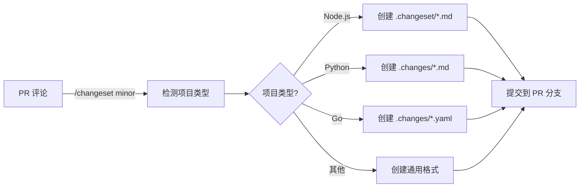

# Changeset Command - Universal Version Management

> 🎯 **一句话说明**：在 PR 评论中输入命令，自动创建版本变更记录（支持多种语言生态）。

## 快速开始

在任何 PR 的评论中输入：

```bash
/changeset patch              # 🩹 Bug 修复 (1.0.0 → 1.0.1)
/changeset minor              # ✨ 新功能  (1.0.0 → 1.1.0)  
/changeset major              # 💥 破坏性变更 (1.0.0 → 2.0.0)
```

## 自动检测项目类型

该命令会自动检测项目类型并创建相应格式的变更记录：

| 项目类型 | 检测方式 | 生成格式 |
|---------|---------|---------|
| **Node.js** | `package.json` | `.changeset/*.md` (Changesets 格式) |
| **Python** | `pyproject.toml` 或 `setup.py` | `.changes/*.md` (Towncrier 格式) |
| **Go** | `go.mod` | `.changes/*.yaml` (YAML 格式) |
| **Java** | `pom.xml` 或 `build.gradle` | `.changes/*.md` |
| **Rust** | `Cargo.toml` | `.changes/*.md` |
| **其他** | - | `.changes/*.md` (通用格式) |

## 工作原理



## 各语言生态示例

### Node.js 项目
```markdown
# 生成文件：.changeset/xxx-pr-123-minor.md
---
"my-package": minor
---

Add dark mode support

Contributed by @user via #123
```

### Python 项目
```markdown
# 生成文件：.changes/123.minor.md
Add dark mode support

Type: feature
PR: #123
Author: @user
```

### Go 项目
```yaml
# 生成文件：.changes/20240101-pr123.yaml
---
kind: minor
module: github.com/org/repo
pr: 123
author: user
description: |
  Add dark mode support
```

### 通用格式
```markdown
# 生成文件：.changes/20240101-pr123.md
# Feature: Add dark mode support

- **Type**: minor
- **PR**: #123
- **Author**: @user
- **Date**: 2024-01-01
```

## 后续处理

创建 changeset 后，各语言生态需要使用相应的工具处理：

- **Node.js**: 使用 `npx changeset version` 和 `npx changeset publish`
- **Python**: 使用 `towncrier` 或 `python-semantic-release`
- **Go**: 使用 `goreleaser` 或自定义脚本
- **Java**: 使用 `maven-release-plugin` 或 `gradle-release`
- **其他**: 使用自定义脚本处理 `.changes/` 目录

## 设计理念

- ✅ **通用概念** - changeset 是所有项目都需要的版本管理概念
- ✅ **生态适配** - 尊重各语言生态的习惯和工具
- ✅ **零学习成本** - 统一的命令接口
- ✅ **灵活扩展** - 易于添加新语言支持

## 许可证

MIT

---

> 💡 **提示**：这是一个通用的版本管理解决方案，适用于任何编程语言的项目。