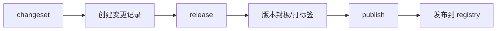

# /publish 命令

> 将已封板的版本发布到各个分发渠道（npm、Docker Hub等）

## 命令定位

`/publish` 是发布流程的最后一步，负责将已经通过 `/release` 封板的版本发布到各个包管理平台。

### 工作流程



### 与 /release 的区别

| 命令 | 职责 | 产出 |
|------|------|------|
| `/release` | 版本管理 | Git 标签、GitHub Release、版本文件更新 |
| `/publish` | 分发管理 | 推送到 npm、Docker Hub、PyPI 等 |

## 支持的发布渠道

### 1. npm 发布

发布 Node.js 包到 npm registry：

```bash
/publish npm                    # 发布到 latest tag
/publish npm --tag beta        # 发布到 beta tag
/publish npm --tag next        # 发布到 next tag
/publish npm --access public   # 公开包
/publish npm --dry-run         # 预览模式
```

**特性**：
- ✅ 支持 OIDC trusted publishing（无需 npm token）
- ✅ 自动检测 package.json
- ✅ 支持 scoped packages
- ✅ 支持自定义 tag

### 2. Docker 发布

发布 Docker 镜像到容器仓库：

```bash
/publish docker                           # 发布到 Docker Hub
/publish docker --tag latest             # 指定标签
/publish docker --platform linux/amd64   # 指定平台
/publish docker --registry ghcr.io       # GitHub Container Registry
/publish docker --registry ecr           # AWS ECR
/publish docker --dry-run                # 预览模式
```

**特性**：
- ✅ 支持多平台构建
- ✅ 支持多个 registry
- ✅ 自动处理认证
- ✅ 支持构建缓存

## 前置条件

1. **必须先执行 `/release`**
   - 版本已经封板
   - Git 标签已创建
   - GitHub Release 已发布

2. **配置要求**

   **npm 发布**：
   - 配置 npm trusted publisher（推荐）
   - 或设置 `NPM_TOKEN` secret

   **Docker 发布**：
   - 设置 `DOCKER_USERNAME` 和 `DOCKER_PASSWORD` secrets
   - 或使用 GitHub Container Registry（自动认证）

## 安全性

### OIDC Trusted Publishing（npm）

2024年7月起，npm 支持 OIDC 无密钥发布：

1. 在 npmjs.com 配置 trusted publisher
2. 无需管理 npm token
3. 使用短期工作流凭证
4. 自动生成 provenance

### 权限控制

```yaml
permissions:
  id-token: write     # OIDC 认证
  contents: read      # 读取代码
  packages: write     # GitHub Packages
```

## 使用场景

### 场景 1：发布 npm 包

```bash
# 1. 创建变更记录
/changeset minor --message "Add new feature"

# 2. 封板版本
/release

# 3. 发布到 npm
/publish npm
```

### 场景 2：发布 Docker 镜像

```bash
# 1. 创建变更记录
/changeset patch --message "Fix bug"

# 2. 封板版本
/release

# 3. 发布到 Docker Hub
/publish docker
```

### 场景 3：预发布版本

```bash
# 1. 创建预发布
/release --prerelease beta

# 2. 发布到 beta tag
/publish npm --tag beta
```

## 自动检测

如果不指定子命令，`/publish` 会自动检测项目类型：

```bash
/publish    # 自动检测并发布
```

检测逻辑：
1. 存在 `package.json` + `lib/` → npm
2. 存在 `Dockerfile` → Docker
3. 存在 `package.json` + `Dockerfile` → 询问用户

## 配置文件

可选配置文件 `.github/publish.yml`：

```yaml
# 默认配置
defaults:
  npm:
    tag: latest
    access: public
    registry: https://registry.npmjs.org
  docker:
    registry: docker.io
    platforms: 
      - linux/amd64
      - linux/arm64
    build_args:
      - NODE_ENV=production
```

## 错误处理

### 常见错误

1. **未找到版本标签**
   - 原因：未执行 `/release`
   - 解决：先执行 `/release` 创建版本

2. **认证失败**
   - 原因：未配置 token 或 OIDC
   - 解决：配置相应的 secrets 或 trusted publisher

3. **包已存在**
   - 原因：版本号重复
   - 解决：检查版本号，使用新版本

## 工作流触发

`/publish` 命令可以在以下位置触发：

- ✅ Issue 评论（使用默认分支）
- ✅ Pull Request 评论（使用 PR 分支）
- ✅ Release 创建后自动触发（可选）

## 最佳实践

1. **分离关注点**
   - `/release` 负责版本管理
   - `/publish` 负责分发管理

2. **使用 OIDC**
   - npm：配置 trusted publisher
   - 避免长期 token

3. **测试发布**
   - 使用 `--dry-run` 预览
   - 先发布到测试 registry

4. **版本策略**
   - 稳定版：发布到 `latest`
   - 预发布：发布到 `beta`/`next`
   - 实验性：发布到 `experimental`

## 未来扩展

计划支持的发布渠道：

- [ ] PyPI（Python）
- [ ] RubyGems（Ruby）
- [ ] Maven Central（Java）
- [ ] crates.io（Rust）
- [ ] NuGet（.NET）
- [ ] GitHub Packages

## 参考资料

- [npm Trusted Publishing](https://docs.npmjs.com/trusted-publishers/)
- [Docker GitHub Actions](https://docs.docker.com/build/ci/github-actions/)
- [GitHub Packages](https://docs.github.com/en/packages)