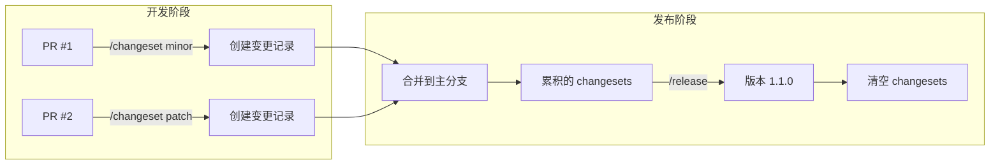
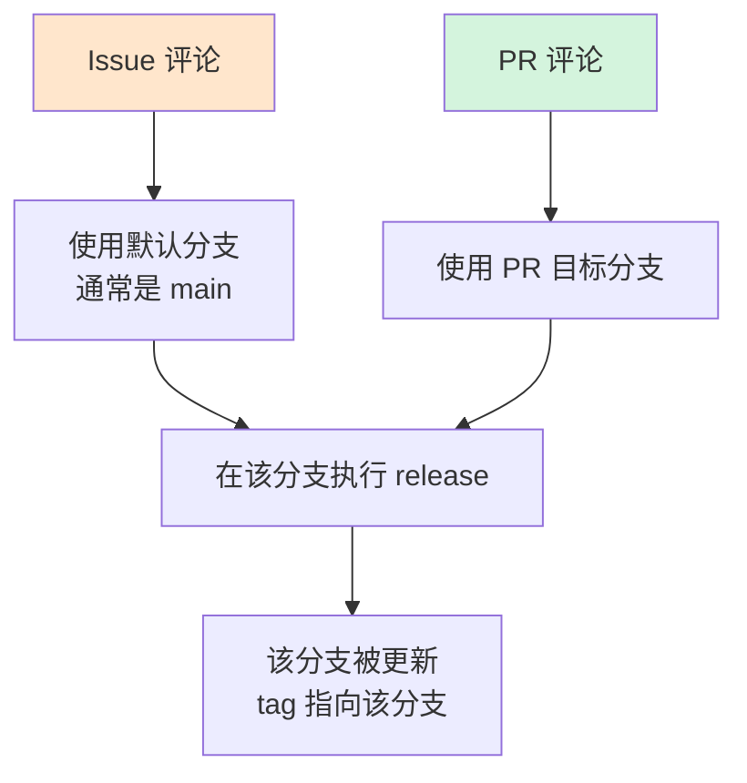
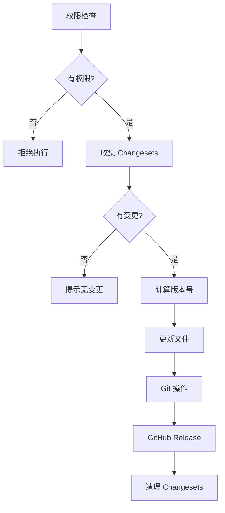

# Release Command - 版本封板与发布

> 🎯 **一句话说明**：将累积的 changesets 转换为正式版本，完成版本封板。

## 快速开始

在 Issue 或 PR 评论中输入：

```bash
/release                        # 发布正式版本
/release --preview              # 预览将要发布的内容
/release --prerelease beta      # 发布预发布版本
/release --prerelease rc        # 发布候选版本
```

## 核心概念

### Release 的职责
**版本封板** - 将累积的 changesets 转换为正式版本，包括：
1. 收集所有未处理的 changesets
2. 计算新版本号
3. 生成/更新 CHANGELOG
4. 创建 git tag
5. 创建 GitHub Release（正式版或预发布版）
6. 清理已处理的 changesets

### GitHub Release 类型

所有版本都会创建 GitHub Release，但有两种类型：

| 命令 | GitHub Release 类型 | 标记 | 说明 |
|-----|-------------------|------|------|
| `/release` | 正式版本 | Latest release ✅ | 成为最新稳定版 |
| `/release --prerelease` | 预发布版本 | Pre-release 🏷️ | 不影响最新稳定版 |

**GitHub Releases 页面显示效果：**
```
✅ v1.1.0                    Latest
   2024-01-15 - 稳定版本

🏷️ v1.1.0-beta.2            Pre-release
   2024-01-10 - 测试版本，请谨慎使用

🏷️ v1.1.0-beta.1            Pre-release  
   2024-01-05 - 测试版本，请谨慎使用

✅ v1.0.0
   2023-12-20 - 上一个稳定版本
```

### 与 Changeset 的关系



## 命令格式

### 基础命令
```bash
/release                        # 根据 changesets 自动决定版本
```

### 预发布选项
```bash
/release --prerelease alpha    # 发布 alpha 版本 (1.1.0-alpha.1) → GitHub Pre-release
/release --prerelease beta     # 发布 beta 版本 (1.1.0-beta.1) → GitHub Pre-release
/release --prerelease rc       # 发布 RC 版本 (1.1.0-rc.1) → GitHub Pre-release
/release --prerelease next     # 发布 next 版本 (1.1.0-next.1) → GitHub Pre-release
/release --prerelease dev      # 发布开发版本 (1.1.0-dev.20240101) → GitHub Pre-release
```

**注意**：所有预发布版本都会创建 GitHub Release，但标记为 Pre-release，不会影响 Latest release。

### 其他选项
```bash
/release --preview              # 预览模式，显示将要执行的操作
/release --graduate             # 将预发布版本转为正式版（不需要 changesets）
/release --force-version 2.0.0  # 强制指定版本号（特殊情况）
```

### 预发布到正式版的升级策略

**问题**：预发布消费了 changesets，正式版没有 changesets 了怎么办？

**解决方案**：

1. **预发布版本锁定机制（推荐，业界标准）**
   ```bash
   # 首次预发布：锁定版本系列
   /release --prerelease beta  # 1.1.0-beta.1
                               # → 创建版本锁
                               # → changesets 保留
   
   # 新增 major changeset 后
   /release --prerelease beta  # 1.1.0-beta.2（仍是 1.1.0 系列）
                               # → 使用锁定版本
                               # → 不会变成 2.0.0
   
   # 正式发布：释放锁
   /release                    # 1.1.0
                               # → 清空所有 changesets
                               # → 删除版本锁
   
   # 下个周期：重新计算
   /release --prerelease beta  # 2.0.0-beta.1（如果有 major）
   ```
   
   版本锁文件：`.changeset/prerelease.lock`
   ```json
   {
     "version": "1.1.0",
     "changesets": ["change-1.md", "change-2.md"],
     "current": "beta.2"
   }
   ```
   
   **业界验证**：
   - **Changesets**：使用 `pre enter/exit` 命令管理预发布模式
   - **Semantic-release**：通过分支配置锁定预发布版本系列
   - **Lerna**：提供 `--conventional-graduate` 升级预发布版本

2. **使用 --graduate**
   ```bash
   # 先发预发布（会消费 changesets）
   /release --prerelease beta  # 1.1.0-beta.1，消费 changesets
   
   # 直接升级版本号（不需要 changesets）
   /release --graduate          # 1.1.0，仅改版本号
   ```

3. **分支策略**
   ```bash
   develop: /release --prerelease beta  # 消费 changesets
   ↓ PR 合并（带新 changesets 或手动创建）
   main: /release                       # 有 changesets 可用
   ```

## 版本号计算规则

### 自动计算
基于收集到的 changesets 类型自动计算：

| Changesets 内容 | 当前版本 | 新版本 |
|----------------|---------|--------|
| major 变更 | 1.0.0 | 2.0.0 |
| minor 变更 | 1.0.0 | 1.1.0 |
| patch 变更 | 1.0.0 | 1.0.1 |
| minor + patch | 1.0.0 | 1.1.0（取最高级别）|

### 预发布版本递增
```
1.0.0 → 1.1.0-alpha.0 → 1.1.0-alpha.1 → 1.1.0-beta.0 → 1.1.0-rc.0 → 1.1.0
```

## 分支策略与发布类型

### 小型项目/团队
```yaml
develop:
  命令: /release --prerelease dev
  版本: 1.1.0-dev.1
  
main:
  命令: /release
  版本: 1.1.0
```

### 开源项目
```yaml
develop:
  命令: /release --prerelease dev
  版本: 1.1.0-dev.20240101
  频率: 每日构建
  
next:
  命令: /release --prerelease next
  版本: 1.1.0-next.1
  频率: 每周/双周
  npm tag: @next
  
main:
  命令: /release --prerelease rc  # 先发 RC
        /release                   # 后发正式版
  版本: 1.1.0-rc.1 → 1.1.0
  npm tag: @latest
```

### 企业级项目
```yaml
develop:
  命令: /release --prerelease alpha
  版本: 1.1.0-alpha.1
  
test:
  命令: /release --prerelease beta
  版本: 1.1.0-beta.1
  
staging:
  命令: /release --prerelease rc
  版本: 1.1.0-rc.1
  
main:
  命令: /release
  版本: 1.1.0
```

## 触发方式与分支关系

### 核心原理
**`/release` 在哪个分支执行，就在哪个分支发布。** 命令本身不指定分支，而是由触发上下文决定。



### 已实现（开箱即用）

通过 `commands/release/release.yml` 提供：

| 触发方式 | 分支决定方式 | 适合场景 |
|---------|------------|---------|
| **PR 评论** | PR 的目标分支 | ✅ 任何版本（分支明确） |
| **Issue 评论** | 仓库默认分支（通常 main） | ⚠️ 主要用于正式版本 |

### 具体操作示例

#### 场景 1：在 develop 分支发布 beta
```bash
# 方法：创建指向 develop 的 PR
1. 创建 PR: feature → develop
2. 在 PR 评论: /release --prerelease beta
3. 结果: 在 develop 分支创建 v1.1.0-beta.1
```

#### 场景 2：在 main 分支发布正式版
```bash
# 方法 A：使用 Issue（因为 main 是默认分支）
1. 创建 Issue: "Release v1.1.0"
2. 在 Issue 评论: /release
3. 结果: 在 main 分支创建 v1.1.0

# 方法 B：使用 PR
1. 创建 PR: staging → main
2. 合并 PR
3. 在 PR 评论: /release
4. 结果: 在 main 分支创建 v1.1.0
```

#### 场景 3：在非默认分支发布
```bash
# ⚠️ Issue 不能直接在非默认分支发布
Issue 评论: /release --prerelease alpha
结果: 总是在 main 发布（可能不是你想要的）

# ✅ 使用 PR 来明确分支
PR (feature → develop) 评论: /release --prerelease alpha
结果: 在 develop 分支发布
```

### 重要提醒

⚠️ **Issue 的限制**：
- Issue 不属于任何分支
- 始终使用仓库默认分支（通常是 main）
- 如需在其他分支发布，必须使用 PR

💡 **最佳实践**：
- 预发布版本 → 使用 PR 评论（分支明确）
- 正式版本 → Issue 或 PR 都可以（main 是默认分支）
- 不确定时 → 创建一个空 PR 来明确分支

### 需要额外配置

以下触发方式需要在你的项目中创建额外的 workflow：

| 触发方式 | 配置文件 | 说明 |
|---------|---------|------|
| PR 合并自动触发 | `.github/workflows/auto-release.yml` | 合并后自动发布 |
| GitHub UI 手动触发 | 修改 `release.yml` 添加 `workflow_dispatch` | Actions 页面手动触发 |
| 定时发布 | 修改 `release.yml` 添加 `schedule` | 定期自动发布 |
| Push 到特定分支 | `.github/workflows/push-release.yml` | 推送触发发布 |

### 推荐的触发场景

| 版本类型 | 推荐触发方式 | 原因 |
|---------|------------|------|
| 开发版本 (dev/alpha) | Issue 评论 | 灵活快速，无需 PR |
| 预发布版本 (beta/rc) | PR 评论 | 需要代码审核 |
| 正式版本 | PR 合并后自动 或 Issue 评论 | 确保代码已审核 |

## 权限控制

- 仅拥有 **write** 权限以上的用户可以执行
- 包括：admin、maintain、write 角色
- 贡献者需要请求维护者帮助发布

## 工作流程



## 实际案例

### 案例 0：完整的发布流程示例

```bash
# 1. 开发阶段 - 在各个 PR 中创建 changesets
PR #101 评论: /changeset minor "Add user authentication"
PR #102 评论: /changeset patch "Fix login bug"
PR #103 评论: /changeset patch "Update documentation"

# 2. 准备发布 - 创建一个 Release Issue
创建 Issue: "Release v1.1.0"
内容: "准备发布 1.1.0 版本，包含用户认证功能"

# 3. 在 Issue 中预览
Issue #104 评论: /release --preview
机器人回复: "将发布 v1.1.0，包含 1 个 minor 和 2 个 patch 变更"

# 4. 正式发布
Issue #104 评论: /release
机器人回复: "✅ 已发布 v1.1.0"

# 5. 发布预发布版本（如需要）
Issue #104 评论: /release --prerelease beta
机器人回复: "✅ 已发布 v1.2.0-beta.1"
```

### 案例 1：常规发布
```bash
# 开发阶段
PR #1: /changeset minor "Add dark mode"
PR #2: /changeset patch "Fix memory leak"
PR #3: /changeset patch "Update docs"

# 发布阶段（main 分支）
/release
# 结果：1.0.0 → 1.1.0（minor 是最高级别）
```

### 案例 2：预发布流程
```bash
# next 分支
/release --prerelease beta
# 结果：1.1.0-beta.1

# 继续修复
PR #4: /changeset patch "Fix beta issue"
/release --prerelease beta
# 结果：1.1.0-beta.2

# 准备正式版（main 分支）
/release --prerelease rc
# 结果：1.1.0-rc.1

# 发布正式版
/release
# 结果：1.1.0
```

### 案例 3：强制版本
```bash
# 里程碑发布，即使只有 minor 变更
/release --force-version 2.0.0
# 结果：强制发布 2.0.0
```

## 多语言支持

自动检测项目类型并执行相应的发布流程：

| 项目类型 | 检测方式 | 版本文件 | 包管理器 |
|---------|---------|---------|---------|
| Node.js | package.json | package.json | npm/yarn/pnpm |
| Python | pyproject.toml | pyproject.toml | pip/poetry |
| Go | go.mod | version.go | go modules |
| Rust | Cargo.toml | Cargo.toml | cargo |
| Java | pom.xml | pom.xml | maven |

## 与 /publish 的区别

```mermaid
graph LR
    A[/changeset<br/>记录变更] --> B[/release<br/>版本封板]
    B --> C[GitHub Release<br/>唯一发布渠道]
    B --> D[/publish<br/>分发到其他渠道]
    D --> E[npm<br/>Docker<br/>PyPI<br/>...]
    
    style C fill:#d4f4dd
```

- **/release**：负责版本管理和 GitHub Release（包括正式版和预发布版）
- **/publish**：负责分发到各种渠道（npm、Docker 等）

### GitHub Release 的作用

1. **版本归档** - 所有版本（包括预发布）都有永久记录
2. **二进制分发** - 可以上传编译好的文件供下载
3. **变更日志** - 自动展示该版本的所有变更
4. **版本标记** - 区分稳定版（Latest）和测试版（Pre-release）
5. **API 访问** - 其他工具可以通过 API 获取版本信息

## 注意事项

1. **Changesets 是前置条件**
   - 必须先有 changesets 才能 release
   - 没有 changesets 会提示无内容可发布

2. **版本号不可回退**
   - 一旦发布，版本号不能重复使用
   - 错误发布需要发新的修复版本

3. **清理机制**
   - Release 成功后会自动清理已处理的 changesets
   - 下次 release 将从新的 changesets 开始

4. **分支保护**
   - 建议在主分支启用分支保护
   - 通过 PR 合并来触发正式版本发布

## 额外触发方式示例

### PR 合并后自动发布

创建 `.github/workflows/auto-release.yml`：

```yaml
name: Auto Release on Merge

on:
  pull_request:
    types: [closed]
    branches: [main]

jobs:
  auto-release:
    if: github.event.pull_request.merged == true
    runs-on: ubuntu-latest
    steps:
      - uses: actions/checkout@v4
      - name: Check for changesets
        id: check
        run: |
          if ls .changeset/*.md 2>/dev/null | grep -v README.md | grep -q .; then
            echo "has_changesets=true" >> $GITHUB_OUTPUT
          fi
      
      - name: Create Release Comment
        if: steps.check.outputs.has_changesets == 'true'
        uses: actions/github-script@v7
        with:
          script: |
            // 创建一个 Issue 并触发 release
            const issue = await github.rest.issues.create({
              owner: context.repo.owner,
              repo: context.repo.repo,
              title: 'Auto Release after PR #${{ github.event.pull_request.number }}',
              body: '/release'
            });
```

### 手动触发支持

修改 `commands/release/release.yml` 添加：

```yaml
on:
  issue_comment:
    types: [created]
  workflow_dispatch:
    inputs:
      prerelease:
        description: 'Prerelease type (leave empty for stable)'
        required: false
        default: ''
        type: choice
        options: ['', 'alpha', 'beta', 'rc', 'next', 'dev']
```

## 配置文件

项目根目录的 `.changeset/config.json` 可以自定义行为：

```json
{
  "changelog": "@changesets/cli/changelog",
  "commit": false,
  "access": "public",
  "baseBranch": "main",
  "updateInternalDependencies": "patch"
}
```

## 故障排除

### 无 changesets 错误
```
⚠️ No changesets found
```
**解决**：先使用 `/changeset` 命令创建变更记录

### 权限不足
```
❌ Permission denied
```
**解决**：请求仓库维护者帮助执行

### 版本冲突
```
❌ Version already exists
```
**解决**：检查是否已发布该版本，使用新版本号

## 业界实践参考

### 主流工具的预发布机制对比

| 工具 | 进入预发布 | 版本锁定 | 保留 changesets | 升级正式版 |
|-----|-----------|---------|----------------|-----------|
| **Changesets** | `pre enter beta` | ✅ 锁定版本系列 | ✅ 预发布期间保留 | `pre exit` + `version` |
| **Semantic-release** | 分支配置 | ✅ 自动锁定 | ✅ 自动管理 | 合并到主分支 |
| **Lerna** | `--conventional-prerelease` | ✅ 版本状态 | ✅ 保留未发布 | `--conventional-graduate` |
| **我们的方案** | `/release --prerelease` | ✅ 版本锁文件 | ✅ 预发布保留 | `/release --graduate` |

### Changesets 官方实践

```bash
# 进入预发布模式
npx changeset pre enter beta
# 创建版本锁，后续都是 beta 版本

# 发布预发布版本
npx changeset version  # 1.1.0-beta.1
npx changeset publish

# 继续预发布
npx changeset version  # 1.1.0-beta.2
npx changeset publish

# 退出预发布，发布正式版
npx changeset pre exit
npx changeset version  # 1.1.0
npx changeset publish
```

**重要警告**（来自官方文档）：
> "If you decide to do prereleases from the main branch without having a branch for your last stable release, you will block other changes until you exit prerelease mode."

### Semantic-release 配置

```json
// .releaserc.json
{
  "branches": [
    "main",
    {
      "name": "beta",
      "prerelease": true
    }
  ]
}
```

特点：
- beta 分支上的 breaking change → 2.0.0-beta.1
- 后续提交只增加 beta 计数器（beta.2, beta.3）
- 合并到 main 自动发布正式版

### 核心共识

1. **版本系列锁定** - 预发布开始后版本号固定
2. **变更累积不消费** - changesets 在预发布期间保留
3. **明确的生命周期** - 有清晰的进入/退出机制
4. **递增式版本号** - beta.1 → beta.2 → beta.3

## 最佳实践

1. **定期发布**：避免累积过多 changesets
2. **语义化版本**：遵循 major.minor.patch 规范
3. **预发布测试**：正式版前先发 RC 版本
4. **自动化集成**：配合 CI/CD 自动发布
5. **变更可追溯**：每个版本都有完整的 CHANGELOG
6. **分支隔离**：预发布建议在独立分支进行

## 许可证

MIT

---

> 💡 **提示**：`/release` 负责版本封板，`/publish` 负责渠道分发，两者配合完成完整的发布流程。