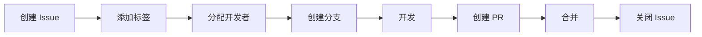

# Issue 管理系统

> 标准化的 Issue 驱动开发工作流

## 概述

本系统提供了一套完整的 Issue 管理方案：
- 📋 标准化的 Label 体系
- 📝 Issue 模板
- 🔄 自动化工作流
- 🎯 Issue 驱动的开发流程

## Label 体系

### 类型标签（必选其一）

| Label | 颜色 | 说明 | 使用场景 |
|-------|------|------|----------|
| `type: feature` | 🟢 绿色 | 新功能开发 | 添加新的功能 |
| `type: bug` | 🔴 红色 | 问题修复 | 修复已知问题 |
| `type: enhancement` | 🔵 浅蓝 | 功能改进 | 改进现有功能 |
| `type: refactor` | 🟡 黄色 | 代码重构 | 优化代码结构 |
| `type: docs` | 🔵 深蓝 | 文档相关 | 文档更新 |

### 优先级标签（必选其一）

| Label | 颜色 | 说明 | 响应时间 |
|-------|------|------|----------|
| `priority: critical` | 🔴 深红 | 紧急 | 立即处理 |
| `priority: high` | 🟠 橙色 | 高 | 24小时内 |
| `priority: medium` | 🟡 黄色 | 中 | 本周内 |
| `priority: low` | 🟢 绿色 | 低 | 有空处理 |

## 快速开始

### 1. 初始化 Labels

```bash
# 方法一：使用脚本
./issues/scripts/setup-labels.sh

# 方法二：使用 GitHub Actions（推送到 main 自动执行）
# 会自动读取 issues/labels.yml 并同步
```

### 2. 创建工作流 Issue

工作流 Issue 是可以直接转化为开发任务的 Issue，具有以下特点：

```markdown
## ✅ 验收标准
- [ ] 具体的可验证的目标
- [ ] 明确的完成标准

## 📋 技术方案
简要的实现思路

## 📊 工作量评估
预计耗时：2-4 小时
```

### 3. Issue 生命周期



## 目录结构

```
issues/
├── labels.yml           # Label 定义
├── templates/          # Issue 模板
│   ├── feature.yml     # 功能模板
│   ├── bug.yml        # Bug 模板
│   └── task.yml       # 任务模板
├── workflows/          # 自动化工作流
│   ├── label-sync.yml  # Label 同步
│   └── issue-ops.yml   # Issue 操作
└── scripts/           # 辅助脚本
    └── setup-labels.sh # 初始化脚本
```

## 使用工作流

### 从 Issue 创建分支

```bash
# Issue #123: 添加用户登录功能
git checkout -b feature/123-user-login
```

### Issue 中的命令

在 Issue 评论中可以使用：

```
/assign @username     # 分配给某人
/label high          # 添加优先级
/estimate 4h         # 估算工时
/create-branch       # 创建对应分支
/close              # 关闭 Issue
```

## 最佳实践

1. **一个 Issue 对应一个 PR**
   - 保持任务粒度适中
   - 便于代码审查

2. **先 Issue 后开发**
   - 明确需求再动手
   - 便于追踪进度

3. **使用模板创建 Issue**
   - 信息完整
   - 格式统一

4. **及时更新状态**
   - 开始开发时分配给自己
   - 完成后关联 PR

## 配置说明

### labels.yml

定义所有项目使用的标签：

```yaml
- name: "标签名称"
  color: "颜色代码"
  description: "标签描述"
```

### 自动同步

推送 `labels.yml` 到 main 分支会自动触发同步：
- 创建不存在的标签
- 更新已存在标签的颜色和描述
- 不会删除额外的标签（安全）

## 进阶功能

### Issue 模板变量

```yaml
# 可以在模板中使用
$ISSUE_NUMBER  # Issue 编号
$ISSUE_AUTHOR  # 创建者
$TIMESTAMP     # 时间戳
```

### 自动化规则

- 新 Issue 自动添加 `priority: medium`
- Bug 类型自动添加 `priority: high`
- 30 天无活动自动添加 `stale` 标签