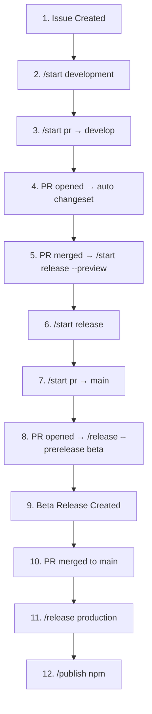

# Node.js OpenSource Workflow Complete Test Suite

本测试套件使用 `act` 模拟完整的工作流程，从issue创建到npm发布的全流程。

## 准备工作

1. 安装 act：
```bash
brew install act
# 或者
curl https://raw.githubusercontent.com/nektos/act/master/install.sh | sudo bash
```

2. 验证环境：
```bash
make setup
```

## 运行测试

### 完整测试流程
```bash
make test
```

### 分阶段测试

测试开发流程（issue → PR → merge to develop）：
```bash
make test-development
```

测试发布流程（release branch → beta → production）：
```bash
make test-release
```

### 单个命令测试

```bash
# Stage 1: Issue创建
make test-issue-created

# Stage 2: 创建开发分支
make test-start-development

# Stage 3: 创建PR到develop
make test-pr-to-develop

# Stage 4: PR opened触发changeset
make test-pr-opened-develop

# Stage 5: PR合并触发release preview
make test-pr-merged-develop

# Stage 6: 创建release分支
make test-start-release

# Stage 7: 创建PR到main
make test-pr-to-main

# Stage 8: PR opened触发beta release
make test-pr-opened-main

# Stage 9: 创建beta版本
make test-release-beta

# Stage 10: PR合并到main
make test-pr-merged-main

# Stage 11: 创建正式版本
make test-release-production

# Stage 12: 发布到npm
make test-publish
```

## 工作流程图



## 测试文件说明

### Fixtures目录
- `01-issue-created.json` - Issue创建事件
- `02-start-development.json` - /start development命令
- `03-start-pr.json` - /start pr命令（到develop）
- `04-pr-opened-develop.json` - PR opened事件（develop）
- `05-pr-merged-develop.json` - PR merged事件（develop）
- `06-start-release.json` - /start release命令
- `07-start-pr-main.json` - /start pr命令（到main）
- `08-pr-opened-main.json` - PR opened事件（main）
- `09-release-beta.json` - /release --prerelease beta命令
- `10-pr-merged-main.json` - PR merged事件（main）
- `11-release-production.json` - /release命令（正式版本）
- `12-publish-npm.json` - /publish命令

## 预期结果

每个阶段应该产生以下结果：

1. **Issue创建**：触发自动化流程
2. **开发分支**：创建 `feature/#100-issue` 分支
3. **PR到develop**：创建PR #101
4. **自动changeset**：生成changeset文件
5. **合并到develop**：触发release preview
6. **Release分支**：创建 `release/0.1.0` 分支
7. **PR到main**：创建PR #102
8. **自动beta**：触发 `/release --prerelease beta`
9. **Beta版本**：创建 `v0.1.0-beta.0` 标签
10. **合并到main**：PR合并成功
11. **正式版本**：创建 `v0.1.0` 标签
12. **NPM发布**：发布到npm registry

## 故障排除

如果测试失败，检查：

1. act是否正确安装
2. Docker是否正在运行
3. 工作流文件路径是否正确
4. fixture文件格式是否正确

## 清理

清理测试生成的文件：
```bash
make clean
```